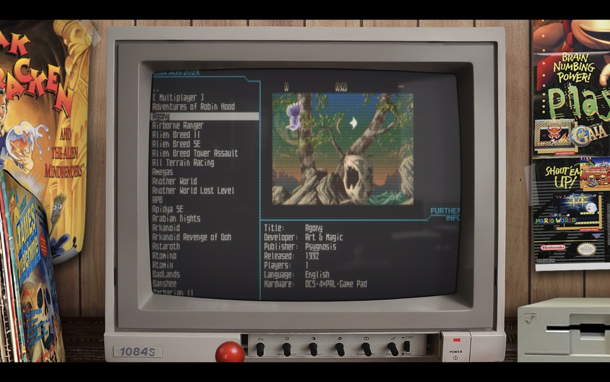
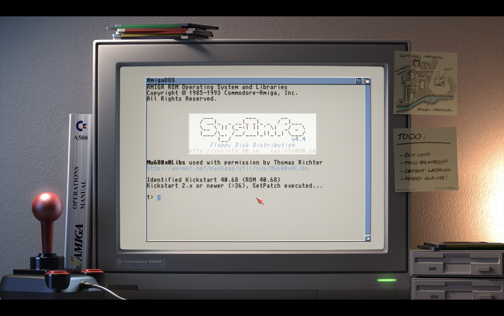

# Amiberry

[](https://github.com/BlitterStudio/amiberry/actions/workflows/c-cpp.yml)
[](https://nightly.link/BlitterStudio/amiberry/workflows/c-cpp.yml/master)
[](https://discord.gg/wWndKTGpGV)
[](https://ko-fi.com/X8X4FHDY4)

**Optimized Amiga emulator for Linux, macOS, Windows, Android, FreeBSD, and Haiku.**

Built on the WinUAE emulation core, Amiberry delivers full Amiga compatibility across ARM and x86 hardware — from a Raspberry Pi to a desktop workstation. Custom JIT compilation for ARM64 and x86-64 provides maximum emulation speed.

## Commercial Use & Sponsorship

Amiberry is free and open source under the [GPL v3 license](LICENSE).
You are welcome to use, modify, and redistribute it under those terms.

**If you are shipping a commercial product, paid subscription service, or
hardware bundle that includes Amiberry**, we ask that you support the project
financially. Amiberry is maintained by a single developer — the features and
platforms your product depends on exist because of community and corporate support.

### Corporate Sponsorship Tiers

| Tier | Monthly | Benefits |
|------|---------|----------|
| 🥉 Supporter | €50/mo | Logo on website, listed in release notes |
| 🥈 Partner | €150/mo | Logo on website + README, early release access, priority issue responses |
| 🥇 Certified Partner | €300/mo | Everything above + "Amiberry Certified Partner" badge for your product/marketing |

👉 [Become a corporate sponsor on Ko-Fi](https://ko-fi.com/amiberry)
📧 For custom arrangements, contact: **your@email.com**

*Individual supporters keep this project alive too —
[any contribution is appreciated](https://ko-fi.com/amiberry).*

> **[Visit amiberry.com](https://amiberry.com)** for the full documentation site.




## Features

- **JIT Compiler** — Custom just-in-time compilation for ARM64 and x86-64
- **WHDLoad Support** — Launch WHDLoad titles directly with automatic configuration
- **Custom Bezels & Shaders** — CRT monitor frames, overlay effects, and GLSL shader support
- **Modern GUI** — Clean Dear ImGui interface navigable by mouse or gamepad
- **Drag & Drop** — Drop floppy images, hard files, and config files directly into the emulator
- **Auto-Update** — Built-in update checker with SHA256-verified downloads
- **RetroArch Ready** — Seamless controller mapping for RetroArch setups

## Quick Install

### Linux

```bash
curl -fsSL https://packages.amiberry.com/install.sh | sudo sh
sudo apt install amiberry
```

Also available via [PPA](https://launchpad.net/~midwan-a/+archive/ubuntu/amiberry) · [COPR](https://copr.fedorainfracloud.org/coprs/midwan/amiberry/) · [Flatpak](https://flathub.org/apps/com.blitterstudio.amiberry) · [AUR](https://aur.archlinux.org/packages/amiberry) · [.deb/.rpm](https://github.com/BlitterStudio/amiberry/releases/latest)

### macOS

```bash
brew install --cask amiberry
```

### Windows

Download the [installer or portable ZIP](https://github.com/BlitterStudio/amiberry/releases/latest).

### Android

Available on [Google Play](https://play.google.com/store/apps/details?id=com.blitterstudio.amiberry) (AArch64 & x86_64 with full ARM64 JIT support).

## Documentation

- **[Getting Started](https://github.com/BlitterStudio/amiberry/wiki/First-Installation)** — First installation guide
- **[Full Wiki](https://github.com/BlitterStudio/amiberry/wiki)** — Complete documentation
- **[Build from Source](https://github.com/BlitterStudio/amiberry/wiki/Compile-from-source)** — Compile for your platform
- **[Troubleshooting](https://github.com/BlitterStudio/amiberry/wiki/Troubleshooting)** — Common issues and solutions

## Building from Source

```bash
cmake -B build -DCMAKE_BUILD_TYPE=Release
cmake --build build -j$(nproc)
```

See the [build guide](https://github.com/BlitterStudio/amiberry/wiki/Compile-from-source) for platform-specific instructions, dependencies, and build options.

## Contributing

Contributions are welcome — bug reports, feature suggestions, and pull requests all help make Amiberry better.

1. Fork the repository
2. Create your feature branch: `git checkout -b feature/my-feature`
3. Commit your changes: `git commit -m 'Add my feature'`
4. Push to the branch: `git push origin feature/my-feature`
5. Open a Pull Request

## Community

[](https://discord.gg/wWndKTGpGV)
[](https://mastodon.social/@midwan)
[](https://ko-fi.com/X8X4FHDY4)

## License

Amiberry is licensed under the [GNU General Public License v3.0](LICENSE).

---

Supported by [JetBrains](https://jb.gg/OpenSourceSupport).
